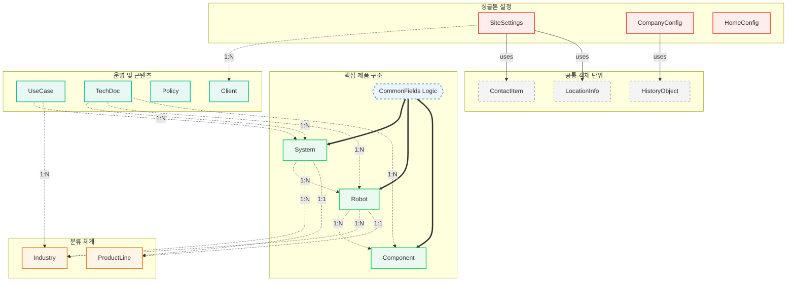

# G1sRobot: Data Infrastructure & Custom CMS Studio

>**기업용 자산 관리 및 비즈니스 로직 제어를 위한 맞춤형 Headless CMS 설계**

---

## ✨ Key Values
### **1. 데이터 단일화_SSOT(Single Source of Truth)**
데이터 정합성을 위한 단일 진실 공급원 구축.
### **2. 비결합 아키텍처_Decoupled Architecture** 
데이터(콘텐츠)와 코드(디자인)의 완전 분리를 통한 독립적 운영 환경.
### **3. 운영 최적화_Operational Excellence** 
운영자의 실수를 방지하는 시스템적 유효성 검사 및 자동화.

---

## 📂 Folder Structure
``` python
📦 g1srobot-robotics-cms
 ├── 📂 schemaTypes/           # 데이터 모델링 (스키마 정의서)
 │    ├── 📂 documents/        # 독립적인 메인 데이터 (로봇, 시스템, 적용사례 등)   
 │    ├── 📂 object/           # 복잡한 중첩 데이터의 구조적 모듈화 + 공통필드 정의
 │    ├── 📂 singletons/       # 싱글톤 스키마
 │    └── 📜 index.ts          # 모든 스키마를 통합 -> config에 전달
 ├── 📂 components/            # CMS 커스터마이징
 │    ├── 📜 AssetRenameInput    # 자산 메타데이터를 직접 조작하는 브릿지 컴포넌트
 │    ├── 📜 SpecsTableInput     # 배열 데이터 -> 엑셀 스타일로 관리하는 그리드 편집기
 ├── 📜 sanity.cli             # CLI 마이그레이션 및 배포 설정
 └── 📜 sanity.config          # Studio 설정 및 환경 구성
```

---

## 📊 Data Architecture

### [데이터 모델링] 관계형 스키마 설계 및 SSOT 확보
[전체 데이터 명세(Full ERD) 보러가기](https://dbdiagram.io/d/G1SRobot-CMS-ERD-6965e619d6e030a024dbf99c)



- **계층적 레퍼런스 모델링:** `System(시스템)` > `Robot(로봇)` > `Component(부품)` 으로 이어지는 1:N 참조 관계 설계하여 데이터 무결성 확보.
- **단일 진실 공급원(SSOT) 구축:** 산업군과 제품군을 독립 엔티티로 분리하여 데이터 중복을 방지하고, 전사적인 데이터 정합성 유지.
- **참조 무결성(Referential Integrity):** 텍스트가 아닌 고유 ID(UUID) 기반의 참조 시스템 구축.
- **싱글톤 운영 아키텍처:** 사이트 전역 설정 데이터를 싱글톤으로 관리하여 데이터 중복을 방지하고 비개발자 운영자의 실수 방지 및 효율 증대.
- **구조적 모듈화(Object):** 복잡한 중첩 데이터(제품 사양 등)를 객체 타입으로 캡슐화하여 스키마 가독성을 높이고 유지보수 포인트를 격리한 관심사 분리 기반 설계.
- **공통 필드(Mix-in) 전략:** 여러 스키마가 공유하는 속성을 상수로 모듈화하여 중복 코드를 제거하고 전 제품군의 데이터 규격 일관성을 강제한 상속형 스키마 설계.

---
## 🎛️ Studio Customization

### [CMS 커스터마이징] 운영 효율화

- **코드-콘텐츠 완전 분리(Decoupled):** 모든 마케팅 텍스트와 에셋을 CMS로 관리하여 개발자의 개입 없는 실시간 사이트 운영 환경 구축
- **`AssetTitleInput`(에셋 동기화):** 파일 업로드 시 서버 에셋을 역조회를 통 파일명을 제목 필드와 실시간 동기화하여 이미지 에셋 접근성 및 Technical SEO 대응.
- **`SpecsTableInput` (그리드 편집기):** 복잡한 제품 사양을 엑셀 스타일로 관리할 수 있도록 커스텀 UI 구축.
<table align='center' border="0" cellpadding="0" cellspacing="0">
    <tr align='center' style="border: none;">
        <td style='border: none;'><b>Before (기본 편집기)</b></td>
        <td style="border: none;"></td>
        <td style="border: none;"><b>After (커스텀 그리드 편집기)</b></td>
    </tr>
    <tr align="center" style="border: none;" >
        <td style="border: none;">
            
        </td>
        <td style="border: none;" >
            <h1>→</h1>
        </td>
        <td style="border: none;">
            
        </td>
    </tr>
    <tr align="center" style="border: none;">
        <td style="border: none;">
            <p><small>단순 배열 형태로 가독성이 낮고<br>오입력 위험이 높았던 기존 구조</small></p>
        </td>
        <td style="border: none;"></td>
        <td style="border: none;">
            <p><small><b>SpecsTableInput</b> 도입으로<br>엑셀 스타일의 직관적인 데이터 관리 구현</small></p>
        </td>
    </tr>
</table>
    
- **Feature Flag (전시 제어):** 기능 플래그(Feature Flag)와 전시 토글을 도입하여 재배포 없는 실시간 서비스 가동 제어 환경 구축.
<table align='center' border="0" cellpadding="0" cellspacing="0">
    <tr align='center' style="border: none;">
        <td style="border: none;">
            
            <br>
            <sub>Feature Flag 및 운영 가이드라인 내재화</sub>
        </td>
    </tr>
</table>

- **Schema Validation (데이터 품질 관리):** 스키마 레벨의 유효성 검사 규칙(Validation Rules)을 적용하여 필수 메타데이터 누락 및 휴먼 에러를 시스템적으로 차단하고, 비개발 운영 환경에서도 일관된 데이터 정합성 확보.

---

## ⚙️ Getting Started
- **Install:** `npm install`
- **Studio 실행 방법:** `sanity dev`/ `npm run dev`
- **배포 방법:** `sanity deploy`
